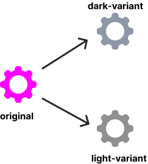

# Theming Documentation
## Basic Architecture
A **theme collection** in Hydrogen is represented by a `manifest.json` file and a `theme.css` file.
The manifest specifies variants (eg: dark,light ...) each of which is a **theme** and maps to a single css file in the build output.

Each such theme is produced by changing the values of variables in the base `theme.css` file with those specified in the variant section of the manifest:


More in depth explanations can be found in later sections.

## Structure of `manifest.json`
[See theme.ts](../src/platform/types/theme.ts)

## Variables
CSS variables specific to a particular variant are specified in the `variants` section of the manifest:
```json=
 "variants": {
     "light": {
         ...
         "variables": {
             "background-color-primary": "#fff",
             "text-color": "#2E2F32",
         }
     },
      "dark": {
         ...
        "variables": {
            "background-color-primary": "#21262b",
            "text-color": "#fff",
        }
    }
 }
```

These variables will appear in the css file (theme.css):
```css=
body {
    background-color: var(--background-color-primary);
    color: var(--text-color);
}
```

During the build process, this would result in the creation of two css files (one for each variant) where the variables are substitued with the corresponding values specified in the manifest:

*element-light.css*:
```css=
body {
    background-color: #fff;
    color: #2E2F32;
}
```

*element-dark.css*:
```css=
body {
    background-color: #21262b;
    color: #fff;
}
```

## Derived Variables
In addition to simple substitution of variables in the stylesheet, it is also possible to instruct the build system to first produce a new value from the base variable value before the substitution.

Such derived variables have the form `base_css_variable--operation-arg` and can be read as:
apply `operation` to `base_css_variable` with argument `arg`.

Continuing with the previous example, it possible to specify:
```css=
.left-panel {
    /* background color should be 20% more darker
       than background-color-primary */
    background-color: var(--background-color-primary--darker-20);
}
```

Currently supported operations are:

| Operation | Argument | Operates On |
| -------- | -------- | -------- |
| darker     | percentage | color |
| lighter     | percentage | color |

## Aliases
It is possible give aliases to variables in the `theme.css` file:
```css=
:root {
    font-size: 10px;
    /* Theme aliases */
    --icon-color: var(--background-color-secondary--darker-40);
}
```
It is possible to further derive from these aliased variables:
```css=
div {
    background: var(--icon-color--darker-20);
    --my-alias: var(--icon-color--darker-20);
    /* Derive from aliased  variable */
    color: var(--my-alias--lighter-15);
}
```


## Colorizing svgs
Along with a change in color-scheme, it may be necessary to change the colors in the svg icons and images. 
This can be done by supplying the preferred colors with query parameters:
`my-awesome-logo.svg?primary=base-variable-1&secondary=base-variable-2`  

This instructs the build system to colorize the svg with the given primary and secondary colors.
`base-variable-1` and `base-variable-2` are the css-variables specified in the `variables` section of the manifest.

For colorizing svgs, the source svg must use `#ff00ff` as the primary color and `#00ffff` as the secondary color:

  

|  |  |
| :--: |:--: |
| **original source image** | **transformation process** |

## Creating your own theme variant in Hydrogen
If you're looking to change the color-scheme of the existing Element theme, you only need to add your own variant to the existing `manifest.json`.

The steps are fairly simple:
1. Copy over an existing variant to the variants section of the manifest.
2. Change `dark`, `default` and `name` fields.
3. Give new values to each variable in the `variables` section.
4. Build hydrogen.

## Creating your own theme collection in Hydrogen
If a theme variant does not solve your needs, you can create a new theme collection with a different base `theme.css` file.
1. Create a directory for your new theme-collection under `src/platform/web/ui/css/themes/`.
2. Create `manifest.json` and `theme.css` files within the newly created directory.
3. Populate `manifest.json` with the base css variables you wish to use.
4. Write styles in your `theme.css` file using the base variables, derived variables and colorized svg icons.
5. Tell the build system where to find this theme-collection by providing the location of this directory to the `themeBuilder` plugin in `vite.config.js`:
```json=
...
themeBuilder({
    themeConfig: {
        themes: {
            element: "./src/platform/web/ui/css/themes/element",
            awesome: "path/to/theme-directory"
        },
        default: "element",
    },
    compiledVariables,
}),
...
```
6. Build Hydrogen.

## Changing the default theme
To change the default theme used in Hydrogen, modify the `defaultTheme` field in `config.json` file (which can be found in the build output):
```json=
"defaultTheme": {
    "light": theme-id,
    "dark": theme-id
}
```

Here *theme-id* is of the form `theme-variant` where `theme` is the key used when specifying the manifest location of the theme collection in `vite.config.js` and `variant` is the key used in variants section of the manifest.

Some examples of theme-ids are `element-dark` and `element-light`.  

To find the theme-id of some theme, you can look at the built-asset section of the manifest in the build output.

This default theme will render as "Default" option in the theme-chooser dropdown. If the device preference is for dark theme, the dark default is selected and vice versa.

**You'll need to reload twice so that Hydrogen picks up the config changes!**

# Derived Theme(Collection)
This allows users to theme Hydrogen without the need for rebuilding. Derived theme collections can be thought of as extensions (derivations) of some existing build time theme. 

## Creating a derived theme:
Here's how you create a new derived theme:
1. You create a new theme manifest file (eg: theme-awesome.json) and mention which build time theme you're basing your new theme on using the `extends` field. The base css file of the mentioned theme is used for your new theme.
2. You configure the theme manifest as usual by populating the `variants` field with your desired colors.
3. You add your new theme manifest to the list of themes in `config.json`.

Refresh Hydrogen twice (once to refresh cache, and once to load) and the new theme should show up in the theme chooser.

## How does it work?

For every theme collection in hydrogen, the build process emits a runtime css file which like the built theme css file contains variables in the css code. But unlike the theme css file, the runtime css file lacks the definition for these variables:

CSS for the built theme:
```css
:root {
    --background-color-primary: #f2f20f;
}

body {
    background-color: var(--background-color-primary);
}
```
and the corresponding runtime theme:
```css
/* Notice the lack of definiton for --background-color-primary here! */
body {
    background-color: var(--background-color-primary);
}
```

When hydrogen loads a derived theme, it takes the runtime css file of the extended theme and dynamically adds the variable definition based on the values specified in the manifest. Icons are also colored dynamically and injected as variables using Data URIs.
